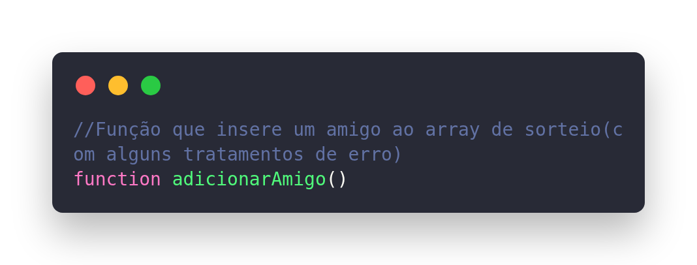
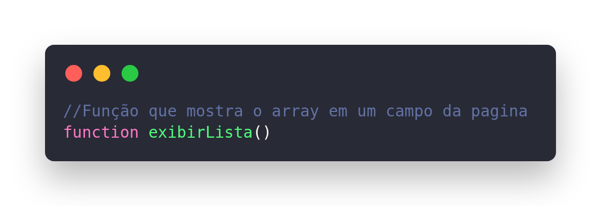
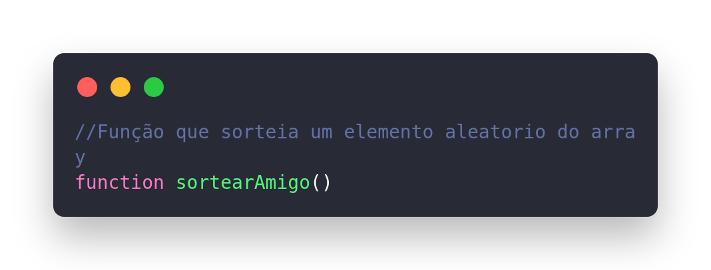
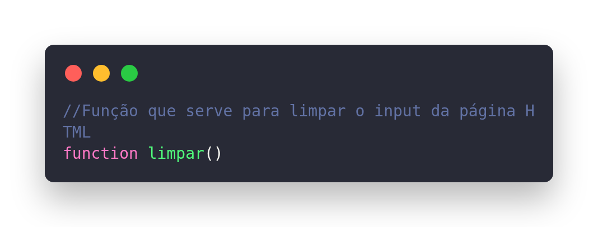

<h1 align="center">Descrição</h1>

Esse é um site simples onde o usuário digita uma lista de nomes que (não repetidos), e sorteia um nome aleatorio da lista;

<h1 align="center">Documentação</h1>

A estrutura de dados usada nesse projeto é um array simples, no qual apenas são inseridos elementos no final. Por ser um projeto simples, que vai apenas cumprir uma tarefa específica.  

Essa é uma função que insere sempre no final do array os nomes dos participantes do sorteio. Ela também contem dois tratamentos de erros impedindo que o usuário insira nomes repetidos ou não insira nome algum caso ele não preencha o campo e clique em adicionar. 

Essa função acessa diretamente um campo da padiga e passa as informções do array para esse local para ficar visivel para o usuário. Exibindo os nomes um sobre o outro.

Essa função captura um índice qualquer do array (não captura índices fora do array). E com esse índice ele verifica o conteúdo( o nome do sorteado) e exibe o nome da pessoa que ganhará o sorteio.

Essa função limpa o campo onde o usuário insere os nomes sempre depois de clicar no botão adicionar.

<h1 align="center">Visualização do Site</h1>

